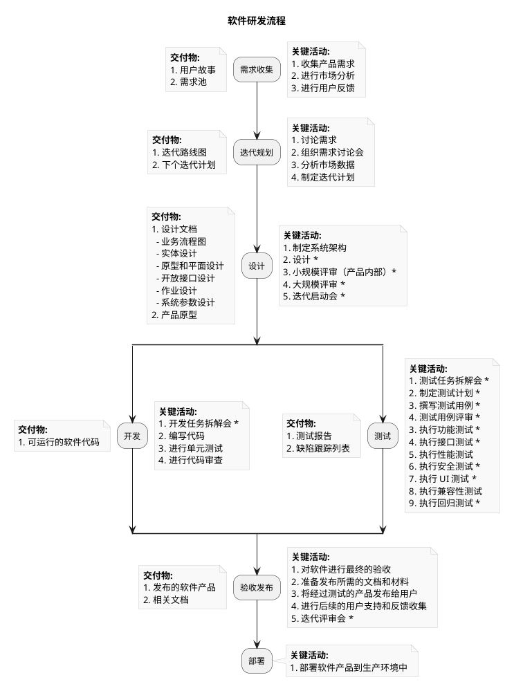

# 使用 PlantUML、Mermaid、Flowchart 和 Graphviz 绘制流程图

在现代软件开发和项目管理中，流程图是帮助团队理解和沟通复杂概念的重要工具。本文将探讨几种流行的文本绘图工具，包括 PlantUML、Mermaid、Flowchart 和 Graphviz，并比较它们的优缺点。

## 文本绘图工具

文本绘图工具使用户能够通过简单的文本描述来创建图形。以下是我们将讨论的几种工具：

## 工具对比

| 工具      | 特点                           | 适用场景                      | 美观性 | 学习曲线 | 优点                     | 缺点           |
| --------- | ------------------------------ | ----------------------------- | ------ | -------- | ------------------------ | -------------- |
| PlantUML  | 强大的 UML 图生成工具          | 需要高质量图形的场合          | 高     | 中       | 生成高质量图形，功能强大 | 语法相对复杂   |
| Mermaid   | 轻量级，适合快速绘制简单图表   | Markdown 文档中的快速原型设计 | 中     | 低       | 易于使用，快速绘制       | 功能相对较少   |
| Flowchart | 直观易用的流程图工具           | 简单流程图的快速绘制          | 中     | 低       | 简单易用，快速上手       | 功能有限       |
| Graphviz  | 适合复杂图形结构的开源绘图工具 | 复杂图形结构的绘制            | 高     | 中       | 强大的布局算法           | 学习曲线较陡峭 |

## 使用工具

在实践中，我们可以使用多种方法来使用这些绘图工具：

- Visual Studio Code

  我们可以使用插件来支持这些绘图工具的预览功能。

  - **PlantUML** 插件可以让您实时预览 UML 图。
  - **Markdown Preview Mermaid Support** 插件则支持在 Markdown 中预览 Mermaid 图。

- 语雀

  语雀提供了文本绘图的功能，用户可以在其中撰写和预览图表。

## Markdown 中的图表

值得一提的是，PlantUML 和 Mermaid 图表可以直接嵌入到 Markdown 文档中，这使得在撰写技术文档时更加方便。

## 示例

接下来，我将提供一个绘制好的示例，以展示如何使用 PlantUML 进行流程图的创建。

效果图：

