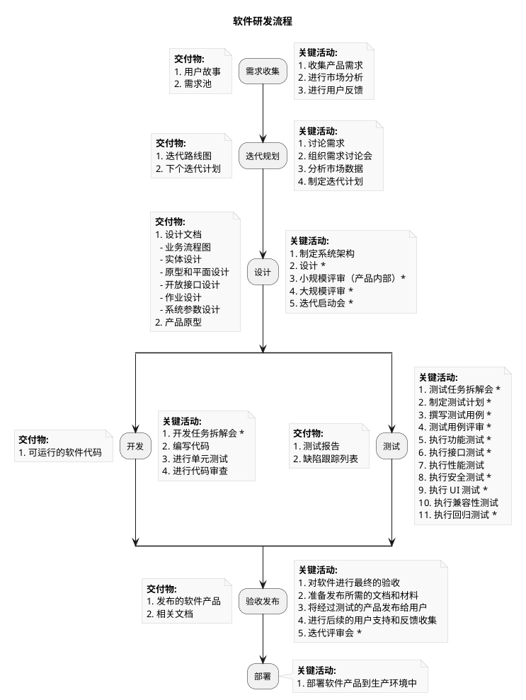

# 使用 PlantUML、Mermaid、Flowchart 和 Graphviz 绘制技术图表

在现代软件开发和项目管理中，“图”并不只有流程图。需求分析阶段会用用户旅程图、状态图和决策树；架构设计阶段会用组件图、部署图、C4 图和依赖图；研发协作阶段会用时序图、甘特图、看板、Git 分支图和因果分析图。

这篇文章的主旨是：**先判断要表达哪类关系，再选择合适的图，最后才选择绘图工具。** 工具只是落地方式，图的类型才决定表达是否准确。

本文结构如下：

1. 先给出快速结论，方便直接选图和选工具。
2. 再说明如何根据表达目标选择图类型。
3. 然后比较 PlantUML、Mermaid、flowchart.js 和 Graphviz 的能力边界。
4. 最后给出落地使用建议和一个 PlantUML 活动图示例。

本文聚焦四类常见的文本绘图工具：

- **PlantUML**：偏软件工程建模，尤其适合 UML、架构、业务流程、数据结构和工程交付物。
- **Mermaid**：偏 Markdown 文档内嵌，适合快速表达流程、时序、状态、ER、甘特、看板、图表和轻量架构。
- **flowchart.js**：只做简单流程图，语法直观，适合浏览器里快速渲染标准流程。
- **Graphviz**：偏通用图布局引擎，适合依赖关系、网络拓扑、调用图、状态空间、知识图谱等节点和边很多的图。

## 结论摘要

如果只想快速决策，可以先记住两句话：

- 不确定用什么图时，先问：我要表达的是**顺序、交互、状态、结构、部署、时间、层级、复杂关系，还是数据**。
- 不确定用什么工具时，默认 Mermaid；需要严谨工程模型用 PlantUML；节点关系太复杂用 Graphviz；只做简单网页流程图再考虑 flowchart.js。

精简速查：

| 场景 | 图类型 | 工具 |
| --- | --- | --- |
| 讲顺序 | 流程图、活动图 | Mermaid、PlantUML |
| 讲交互 | 时序图 | PlantUML、Mermaid |
| 讲状态 | 状态图 | PlantUML、Mermaid |
| 讲结构 | C4 图、组件图、类图、ER 图 | PlantUML、Mermaid |
| 讲部署和网络 | 部署图、拓扑图、依赖图 | PlantUML、Graphviz |
| 讲计划 | 甘特图、时间线 | Mermaid、PlantUML |
| 讲拆解 | WBS、Mindmap、TreeView | PlantUML、Mermaid |
| 讲复杂关系 | 有向图、无向图、知识图谱 | Graphviz |
| 讲数值 | Sankey、XY Chart、Radar、Treemap | Mermaid |

## 第一步：选图

选图的核心是判断“关系类型”。一张好图只回答一个主要问题：顺序、交互、状态、结构、部署、时间、层级、关系或数据。不要让一张图同时承担所有解释任务。

| 想表达的问题 | 推荐图类型 | 适合场景 |
| --- | --- | --- |
| 事情怎么一步步发生 | 流程图、活动图、用户旅程图 | 业务流程、审批流、研发流程、用户操作路径 |
| 谁和谁按什么顺序交互 | 时序图 | 接口调用、登录认证、支付链路、消息队列、异步回调 |
| 对象有哪些状态，如何迁移 | 状态图 | 订单、工单、任务、设备、账号、连接会话生命周期 |
| 系统由哪些部分组成 | C4 图、组件图、架构图 | 系统上下文、服务边界、模块职责、平台架构 |
| 代码或领域对象如何关联 | 类图、对象图、ER 图 | 领域模型、数据库表关系、对象结构 |
| 服务部署在哪里，网络如何连接 | 部署图、网络拓扑图、依赖图 | 生产部署、服务拓扑、上下游影响分析 |
| 时间计划和里程碑如何安排 | 甘特图、时间线、Chronology | 项目计划、版本路线、事件复盘 |
| 任务或知识如何拆解 | WBS、Mindmap、TreeView、文件树 | 需求拆解、任务拆解、知识整理、目录展示 |
| 很多节点之间有什么关系 | 有向图、无向图、知识图谱 | 包依赖、调用关系、资源关系、状态空间 |
| 数量、流量或比例如何变化 | Sankey、Pie、XY Chart、Radar、Treemap | 流量流向、指标趋势、能力对比、结构占比 |

选图时还要考虑读者和抽象层级：

- 面向业务方：少节点、少术语，优先流程图、用户旅程图、时间线。
- 面向研发团队：保留服务名、接口名、状态名和异常分支，优先 C4 图、组件图、时序图、状态图。
- 面向运维和排障：强调部署位置、网络连接、依赖关系和调用链，优先拓扑图、部署图、依赖图。
- 面向长期维护：节点命名要稳定，避免跟随临时代码变量频繁变化。

如果只是字段清单、接口参数、简单对比，表格通常比图更清楚。只有当“关系、顺序、层级、依赖、状态迁移或数量流向”是重点时，图才真正有价值。

## 第二步：选工具

选工具时，不要只看“能不能画”，还要看文档平台是否支持、团队是否熟悉、图是否会长期维护、是否需要 CI 渲染或校验。

| 工具 | 能力范围 | 最适合的图 | 优点 | 局限 |
| --- | --- | --- | --- | --- |
| PlantUML | UML、架构、流程、计划、数据结构 | UML、C4、活动图、组件图、部署图 | 工程语义强，适合正式设计文档 | 语法体系较大，环境依赖 Java/渲染器 |
| Mermaid | Markdown 内嵌的多类型图表 | 流程图、时序图、ER、甘特、看板、轻量架构 | 文档平台支持广，上手快 | 复杂图控制力有限，不同平台支持版本可能不同 |
| flowchart.js | 标准流程图 | 简单业务流程、判断流程 | DSL 简单，浏览器集成容易 | 只适合流程图 |
| Graphviz | 通用图布局 | 依赖图、网络图、拓扑图、大规模关系图 | 布局引擎强，适合复杂节点关系 | 语义不如 UML 工具明确，样式调优需要经验 |

工具选择建议：

1. README、博客、知识库、轻量方案，优先 Mermaid。
2. 正式设计文档、UML、C4、部署、状态、活动图，优先 PlantUML。
3. 依赖图、拓扑图、调用图、大规模节点关系，优先 Graphviz。
4. 网页里只展示简单标准流程图，并且不需要其他图类型，可以用 flowchart.js。
5. 团队已有统一文档平台时，先看平台支持的渲染版本。Mermaid 尤其要注意版本差异。
6. 图会长期维护时，优先选择文本 DSL 清晰、团队熟悉、CI 能渲染或校验的工具。
7. 一张图超过一个屏幕还看不清时，不要继续调样式，应该拆图。常见拆法是“业务流程图 + C4/组件图 + 时序图 + 部署图”。

## 工具能力

### PlantUML

PlantUML 早期以 UML 出名，但现在已经是比较完整的工程图 DSL。它适合写进设计文档、架构决策记录、需求说明和接口文档。

PlantUML 适合绘制：

- **UML 图**：时序图、用例图、类图、对象图、活动图、组件图、部署图、状态图、时序约束图。
- **架构和建模图**：C4 图、Archimate、实体关系图、信息工程 IE 图、Chen ER 图。
- **流程和计划图**：活动图、甘特图、Chronology、WBS、MindMap。
- **工程辅助图**：网络图、文件树、JSON/YAML 数据结构、EBNF、正则表达式、Wireframe/UI Mockup、Ditaa、SDL、数学公式。

### Mermaid

Mermaid 的优势是贴近 Markdown。GitHub、GitLab、Obsidian、语雀、很多文档平台和静态站点都能直接或通过插件渲染 Mermaid。Mermaid 当前支持的类型已经很多，不再只是流程图和时序图。

Mermaid 适合绘制：

- **软件设计图**：Flowchart、Sequence Diagram、Class Diagram、State Diagram、Entity Relationship Diagram、Requirement Diagram、C4 Diagram、Architecture Diagram、Packet、Block Diagram。
- **项目和协作图**：User Journey、Gantt、Timeline、Kanban、GitGraph、Mindmaps。
- **分析和数据图**：Pie Chart、Quadrant Chart、Sankey、XY Chart、Radar、Treemap、Venn、Ishikawa、Wardley Map。
- **建模补充**：ZenUML、Event Modeling、TreeView。

实践注意：

- Mermaid 很适合“够用即可”的图，不适合把复杂架构画到像专业制图软件一样精细。
- 新版本 Mermaid 支持为部分图选择布局和外观，例如 flowchart 和 state diagram 可使用 Dagre 或 ELK 布局；复杂流程图可尝试 ELK 减少线条交叉。
- 写 Mermaid 时避免节点文字裸写特殊词和复杂符号。比如流程图里的 `end` 容易被解析器误解，稳妥做法是给文本加引号。

### flowchart.js

这里的 flowchart.js 不是通用绘图语言，而是一个专门画简单流程图的浏览器/终端 SVG 渲染器。

flowchart.js 适合绘制：

- 开始/结束节点。
- 普通操作节点。
- 输入、输出、输入输出节点。
- 子流程节点。
- 条件判断节点。
- 并行节点。
- 带方向的连线。

### Graphviz

Graphviz 的重点不是某一种业务图，而是把节点和边自动布局。它用 DOT 语言描述有向图、无向图、子图和集群，再通过不同布局引擎生成图。

Graphviz 适合绘制：

- **有向依赖图**：模块依赖、包依赖、构建依赖、任务 DAG、调用链。
- **无向关系图**：社交网络、知识图谱、资源关联、实体关系探索。
- **层级图**：组织结构、决策树、有限状态空间、编译器 AST。
- **网络拓扑图**：服务节点、路由关系、集群连接。
- **复杂集群图**：按子系统、团队、服务边界分组的大图。

Graphviz 的布局引擎决定了图的气质：

- `dot`：层级/分层有向图，适合依赖图、流程 DAG、调用链。
- `neato`：弹簧模型布局，适合一般网络关系。
- `fdp`：力导向布局，适合无向图。
- `sfdp`：可扩展力导向布局，适合大规模图。
- `circo`：环形布局，适合循环关系。
- `twopi`：径向布局，适合中心向外扩散的关系。
- `osage`：集群图布局，适合分组明显的图。
- `patchwork`：矩形树图，适合按权重展示分组面积。

## 落地使用

### 编辑和预览

在实践中，可以通过下面几种方式使用这些绘图工具：

- **Visual Studio Code**：PlantUML 插件可以实时预览 UML 图；Markdown Preview Mermaid Support 支持在 Markdown 中预览 Mermaid 图。
- **语雀、Obsidian、GitHub、GitLab 等文档平台**：适合直接在文档里嵌入 Mermaid；使用前要确认平台支持的 Mermaid 版本。
- **命令行和 CI**：适合将 PlantUML、Mermaid CLI 或 Graphviz 加入构建流程，保证图能随文档一起生成和检查。

### 写作建议

1. 一张图只回答一个核心问题。
2. 图名要描述结论，而不只是描述类型，例如“订单状态流转图”比“状态图”更清楚。
3. 节点名要稳定，尽量使用业务概念或系统边界，不要使用临时变量名。
4. 大图要拆分：业务流程、系统结构、接口交互、部署拓扑分别画。
5. 复杂图要配合文字解释，不要让读者自己猜重点。

## 示例

下面是一个 PlantUML 活动图示例，用于表达软件研发流程。这个例子适合展示“流程推进 + 并行活动 + 关键交付物”，因此用活动图比单纯的节点关系图更合适。

```puml
@startuml
skinparam defaultTextAlignment left
skinparam noteBackgroundColor #F9F9F9
skinparam noteBorderColor #CCCCCC

title 软件研发流程

:需求收集;
note right
    **关键活动:**
    1. 收集产品需求
    2. 进行市场分析
    3. 进行用户反馈
end note
note left
    **交付物:**
    1. 用户故事
    2. 需求池
end note

:迭代规划;
note right
    **关键活动:**
    1. 讨论需求
    2. 组织需求讨论会
    3. 分析市场数据
    4. 制定迭代计划
end note
note left
    **交付物:**
    1. 迭代路线图
    2. 下个迭代计划
end note

:设计;
note right
    **关键活动:**
    1. 制定系统架构
    2. 设计 *
    3. 小规模评审（产品内部）*
    4. 大规模评审 *
    5. 迭代启动会 *
end note
note left
    **交付物:**
    1. 设计文档
      - 业务流程图
      - 实体设计
      - 原型和平面设计
      - 开放接口设计
      - 作业设计
      - 系统参数设计
    2. 产品原型
end note

split
    :开发;
    note right
        **关键活动:**
        1. 开发任务拆解会 *
        2. 编写代码
        3. 进行单元测试
        4. 进行代码审查
    end note
    note left
        **交付物:**
        1. 可运行的软件代码
    end note
split again
    :测试;
    note right
        **关键活动:**
        1. 测试任务拆解会 *
        2. 制定测试计划 *
        3. 撰写测试用例 *
        4. 测试用例评审 *
        5. 执行功能测试 *
        6. 执行接口测试 *
        7. 执行性能测试
        8. 执行安全测试 *
        9. 执行 UI 测试 *
        10. 执行兼容性测试
        11. 执行回归测试 *
    end note
    note left
        **交付物:**
        1. 测试报告
        2. 缺陷跟踪列表
    end note
end split

:验收发布;
note right
    **关键活动:**
    1. 对软件进行最终的验收
    2. 准备发布所需的文档和材料
    3. 将经过测试的产品发布给用户
    4. 进行后续的用户支持和反馈收集
    5. 迭代评审会 *
end note
note left
    **交付物:**
    1. 发布的软件产品
    2. 相关文档
end note

:部署;
note right
    **关键活动:**
    1. 部署软件产品到生产环境中
end note

@enduml
```

效果图：

## 参考资料

- [PlantUML 支持的图类型](https://github.com/plantuml/plantuml#%EF%B8%8F-supported-diagram-types)
- [Mermaid Diagram Syntax](https://mermaid.ai/open-source/intro/syntax-reference.html)
- [Graphviz DOT Language](https://graphviz.org/doc/info/lang.html)
- [Graphviz Layout Engines](https://graphviz.org/docs/layouts/)
- [flowchart.js README](https://github.com/adrai/flowchart.js/)
